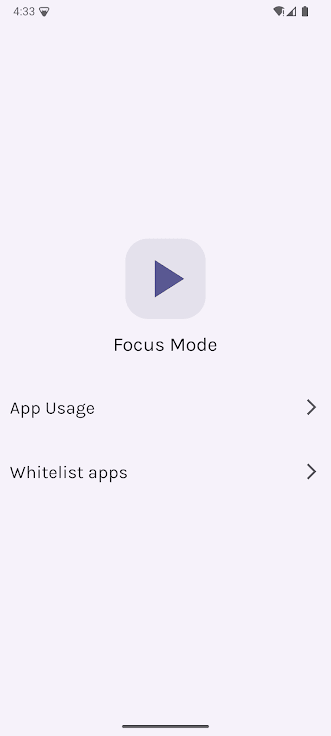
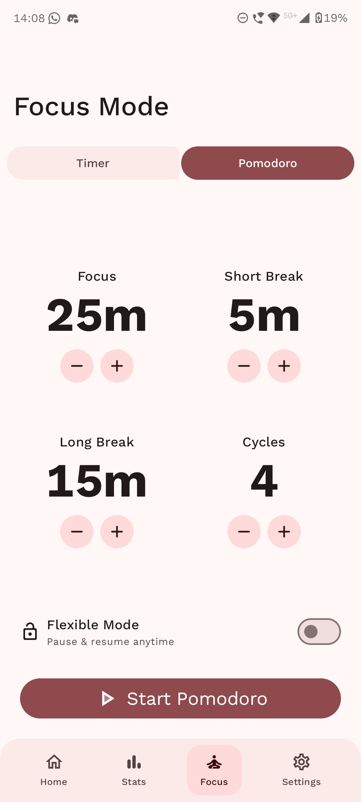
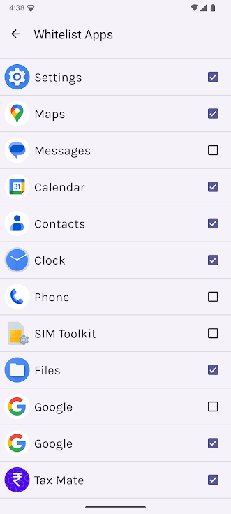
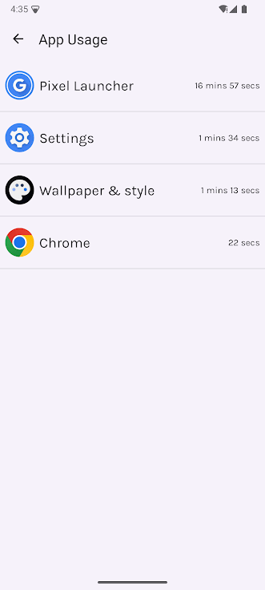
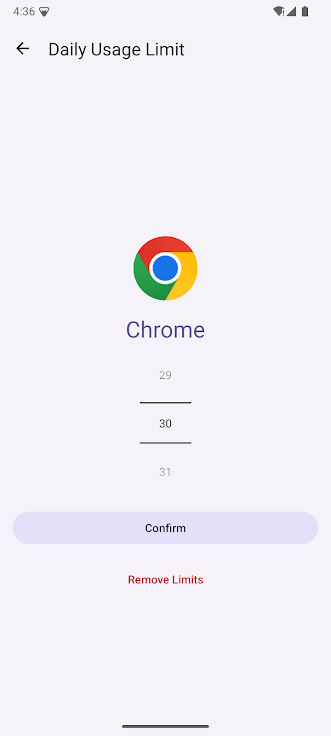
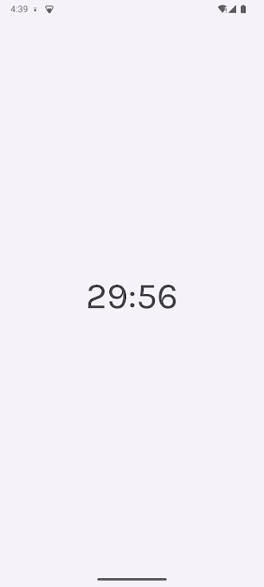
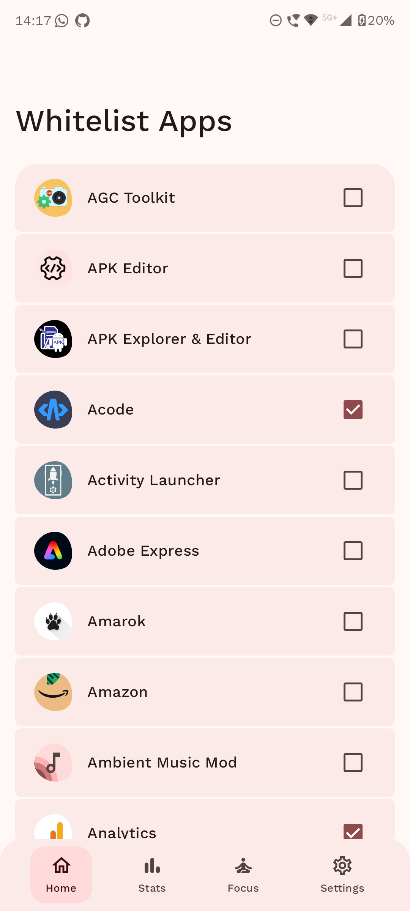
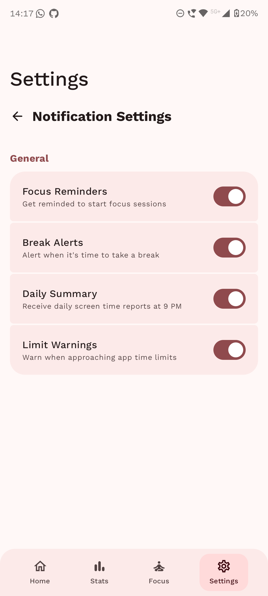
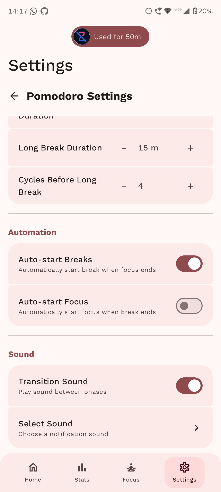

<div align="center">
  

  <h1>Reef</h1>

[](https://opensource.org/licenses/MIT)
[](https://apt.izzysoft.de/packages/dev.pranav.reef)
[](https://hosted.weblate.org/engage/reef/)

</div>

<div align="center">
  <a href="https://apt.izzysoft.de/packages/dev.pranav.reef">
    
  </a>
</div>

Reef is an open-source Android app designed to help you reclaim your focus and build healthier
digital habits. Block distracting apps, track your screen time with detailed analytics, and use
proven productivity techniques like Pomodoro—all wrapped in a beautiful Material You design.

**No ads • No subscriptions • No tracking • Completely free**

---

## Screenshots

<p align="center">
  
  
  
</p>

<p align="center">
  
  
  
</p>

<p align="center">
  
  
  
</p>

---

## Features

### Focus Mode

- **Simple Timer**: Set a custom focus duration and block all distractions during your work session
- **Pomodoro Technique**: Built-in Pomodoro timer with configurable focus, short break, and long
  break durations
- **Strict Mode**: Optionally lock yourself in—no pausing or canceling until the timer ends
- **Auto-Start Options**: Automatically start breaks and next Pomodoro cycles
- **Do Not Disturb**: Automatically enable DND during focus sessions

### App Blocking & Limits

- **Smart App Blocking**: Accessibility-based blocking sends you home when opening blocked apps
- **Daily Time Limits**: Set per-app daily usage limits with minute-level granularity
- **Weekly Usage Charts**: Visualize your app usage patterns with beautiful Vico charts
- **Whitelist System**: Always allow essential apps like phone, messages, and settings

### Routines

- **Scheduled Blocking**: Create routines that automatically activate at specific times
- **Weekly Schedules**: Set different app limits for different days of the week
- **Manual Routines**: One-tap activation for routines when you need them
- **Per-App Limits in Routines**: Each routine can have its own set of app time limits

### Usage Statistics

- **Detailed Analytics**: See exactly where your screen time goes with daily/weekly breakdowns
- **Usage History**: Track your usage patterns over time
- **Daily Summaries**: Get optional daily screen time summary notifications

### Notifications & Alerts

- **Focus Reminders**: Get reminded when you reach for distracting apps during focus
- **Break Alerts**: Know when your break is over and it's time to get back to work
- **Limit Warnings**: Receive alerts when you're close to your daily app limits
- **Customizable Sounds**: Pick your own notification sounds

---

## Why Reef?

Unlike other screen time apps with paywalls, subscriptions, and limited features, Reef is completely
free and open source. No premium features locked behind payments, no artificial limitations. Built
with modern Android technologies and the latest Material 3 Expressive design language, it provides a
beautiful experience while helping you build healthier digital habits.

---

## Getting Started

1. Download Reef from [GitHub Releases](https://github.com/PranavPurwar/Reef/releases)
   or [IzzyOnDroid](https://apt.izzysoft.de/packages/dev.pranav.reef)
2. Grant the necessary permissions:
    - **Usage Access**: Required to track app usage statistics
    - **Accessibility Service**: Required to block apps
    - **Notifications**: For focus reminders and alerts
3. Select apps you want to block or limit
4. Set up your focus routines and time limits
5. Start taking control of your screen time!

---

## Permissions Explained

| Permission              | Why It's Needed                                              |
|-------------------------|--------------------------------------------------------------|
| Usage Access            | To read app usage statistics and enforce time limits         |
| Accessibility Service   | To detect when blocked apps are opened and redirect you home |
| Post Notifications      | To send focus reminders, break alerts, and daily summaries   |
| Display Over Other Apps | For overlay UI when blocking apps                            |
| Do Not Disturb Access   | To automatically enable DND during focus sessions            |
| Exact Alarm             | To schedule routines at precise times                        |

---

## Help Translate

Reef is available in multiple languages. Help make it accessible to more people by contributing
translations on [Weblate](https://hosted.weblate.org/engage/reef/).

---

## Support Development

If Reef has been helpful to you, please consider supporting its development with a small donation.
Every contribution matters.

**Bitcoin (BTC):** `bc1qec5ccz85qn90a6zxnqnes0rx274cv6vw7j5x4g`

**Ethereum (ETH):** `0xD80A8D6E0fa433A8bDFC2D3F325159Db70605816`

**Solana (SOL):** `7FxTAJLmhXFp6wxVbUTpf8jDmzEX1CKVMdE8oLPNQvyb`

**Litecoin (LTC):** `ltc1q3pqyj5ge5rdmqr00w03x4tlhm6rhcc6wrfyx8k`

**Monero (XMR):**
`44w9JtiXxwifyH5CU6Ln1BNViyWNz4z7pEZ4nqbCvUejiK3yEjdyAv6bAofXX2Eh6Fbe3DXJ6eCX6YWKh9SF15fyKBjeJ5H`

**UPI (India):** `pranavpurwar@fam`


---

## License

Reef is licensed under the [MIT License](LICENSE). You are free to use, modify, and distribute this
software.

```text
MIT License

Copyright (c) 2023-2025 Pranav Purwar

Permission is hereby granted, free of charge, to any person obtaining a copy
of this software and associated documentation files (the "Software"), to deal
in the Software without restriction, including without limitation the rights
to use, copy, modify, merge, publish, distribute, sublicense, and/or sell
copies of the Software, and to permit persons to whom the Software is
furnished to do so, subject to the following conditions:

The above copyright notice and this permission notice shall be included in all
copies or substantial portions of the Software.

THE SOFTWARE IS PROVIDED "AS IS", WITHOUT WARRANTY OF ANY KIND, EXPRESS OR
IMPLIED, INCLUDING BUT NOT LIMITED TO THE WARRANTIES OF MERCHANTABILITY,
FITNESS FOR A PARTICULAR PURPOSE AND NONINFRINGEMENT. IN NO EVENT SHALL THE
AUTHORS OR COPYRIGHT HOLDERS BE LIABLE FOR ANY CLAIM, DAMAGES OR OTHER
LIABILITY, WHETHER IN AN ACTION OF CONTRACT, TORT OR OTHERWISE, ARISING FROM,
OUT OF OR IN CONNECTION WITH THE SOFTWARE OR THE USE OR OTHER DEALINGS IN THE
SOFTWARE.
```

---

Thank you for using Reef! Together, we can build healthier digital habits.
